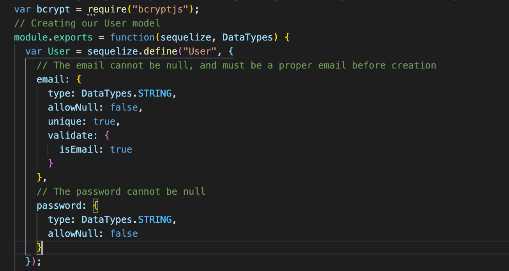

# Reverse Engineering Sequalize
<hr>

[](https://opensource.org/licenses/MIT)

## Description

This website createsa log-in form with a username and password input. 

### Table of Contents

* [Requisites](#requisites)

* [Usage](#usage)

* [Process](#process)

* [License](#license)

* [Contributing](#contributing)

* [Questions](#questions)

## Requisites

In order for this program to run properly some installations may be required.

*Run the below code if a package json is not provided*

```bash
npm init -y
```

*Run the below code to install all necessary packages*

```bash
npm install
```

*To install sequalize, use the below line*

```bash
npm install --save sequalize*
```

## Usage
 
To use the application, run the below code in an integrated terminal.

```bash
node server.js
```

Open a local host by cmd (mac) or ctrl (pc) clicking the link provided in the terminal.

## Process

### Create A Server

The server.js file will require express, the routing code, models, and passport.js.

First the server will set up a port in which the models can be synced up to.

Next by using the below lines of code the server can keep track of a user's login status using sessions.

```bash
app.use(session({ secret: "keyboard cat", resave: true, saveUninitialized: true }));
app.use(passport.initialize());
app.use(passport.session());
```

Finally a link is created between the server and the models then the server is started.

```bash
modellinkname.sequelize.sync().then(function() {
  app.listen(PORT, function() {
    console.log("==> 🌎  Listening on port %s. Visit http://localhost:%s/ in your browser.", PORT, PORT);
  });
});
```

### HTMLs and Javascripts

The HTML's can be created fit the programs needs. The naming conventions of buttons or inputs should be comprehensive so that the server will be able to pass the intakes to the other parts of the program.

These javascript files will be created to match the created HTML files. They will define what actions will be performed when a user inputs some kind of action.

### Config Folder

This folder contains all the files necessary in the log in process such as validating an email and password, or ensuring that a user is in fact logged in

#### isAuthenticted.js

This is middlware file responsible for directing the user to the landing page when not logged in. If the user is logged in as a registered user, it will allow the user to continue to request to the restricted route.

#### passport.js

This file will require the folder models. This file contains code that allows the user to sign in using an email. It will make a call to the functions required through models to check if both the given email/username and password are correspondingly correct inputs.

Sequalize will serialize and deserialize the user for the program to run smoothly between the HTTP requests.
*The below code shows how this is done*

```bash
passport.serializeUser(function(user, cb) {
  cb(null, user);
});

passport.deserializeUser(function(obj, cb) {
  cb(null, obj);
});
```

### Models/index.js

This file will ensure that the password used for comparison is drawn from the config.

It also utilizes 2 main functions.
- filter
    - This function will take out any files that do not start with a 0, are not the base file, and end with .js and return the remaining files
- forEach
    - This function takes in all the files inputted, and create a model for each one

### Model/user.js

This file defines the templating of a user.
The two main elements held within a user are its email and its password. These two elements are further defined and restricted to certain guidelines.
Afterwards, necessary functions regarding a user can be made using the .prototype method.
*below shows the restrictions and guidelines for a user to be created*



## License

This Project is licensed under the MIT License

## Built With:
* [HTML](https://developer.mozilla.org/en-US/docs/Web/HTML)
* [JS](https://developer.mozilla.org/en-US/docs/Web/JS)
* [Node](https://developer.mozilla.org/en-US/docs/Web/API/Node)
* [Sequalize](https://sequelize.org/master/manual/getting-started.html)
* [MySQL](https://developer.mozilla.org/en-US/docs/Glossary/SQL)
## Author(s):
**Brian Lee**
* [GitHub](https://github.com/brianjunhyuplee)
* [LinkedIn](https://www.linkedin.com/in/brian-lee-559208187/)


## Questions

If you have any questions about the repo, open an issue or contact me directly at [brianjunhyuplee@gmail.com](brianjunhyup@gmail.com). You can find more of my work at [brianjunhyuplee](https://github.com/brianjunhyuplee). 
    